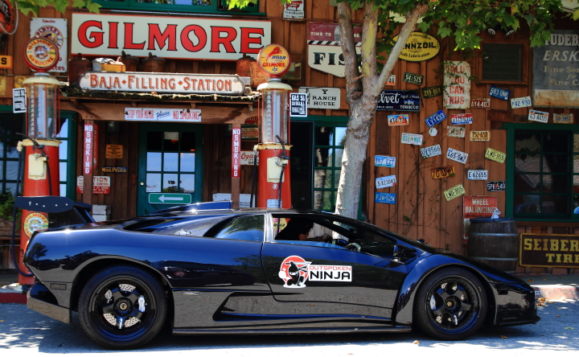
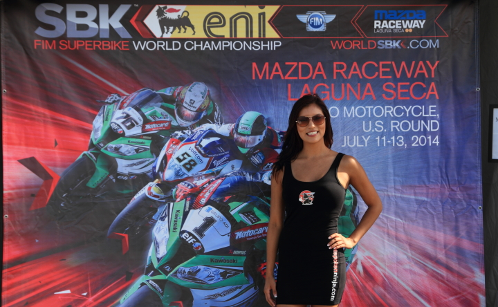
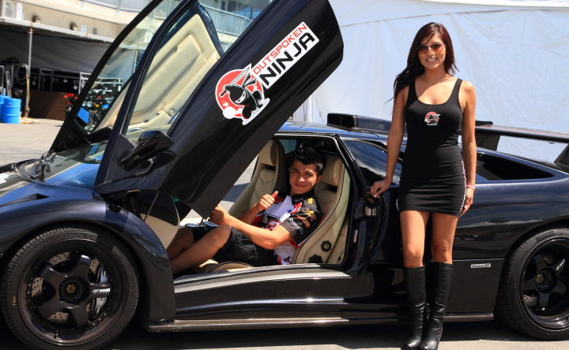
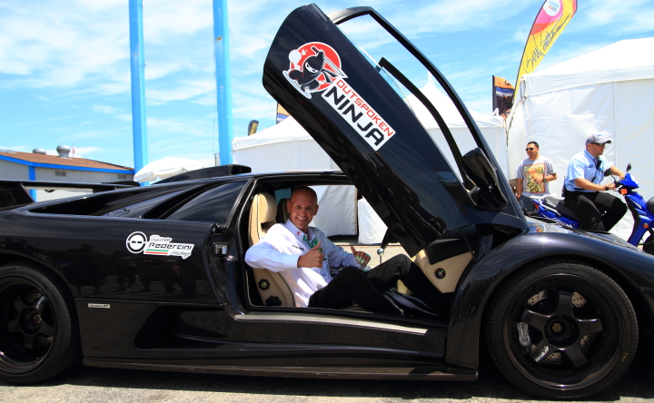
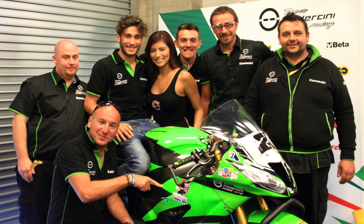
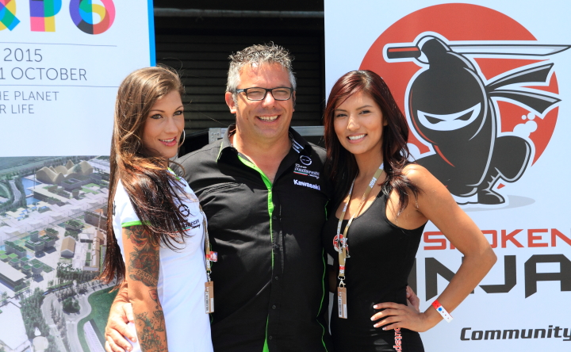

# Search-Demo-POC
Outspoken Ninja - Distributed search aggregator for locating exotic cars and collectable motorcycles.

## History
Originally developed in 2014 as a next generation survey application.  

Ingenii Group LLC was located in the NextSpace shared workspace and business incubator (Santa Cruz, CA). While there, I demonstrating a simplified Craigs List regional webscraper to locate cars or motorcycle I'd like to buy to several other enterpreneurs, and it was qucikly evident the buisness
model for Outspoken Ninja needed to pivot.

In October 2013 completely new business plan and product roadmap for a nation-wide Auto/Truck/Boat/Motorcycle Lifestyle search was born.  After 2 months of development, testing, working with users and potential partners, the first iteration of the search engine was born.

July 2014 saw Outspoken Ninja as US sponsor of the World Superbike Kawasaki satelite team at Laguna Seca, CA.  

  
The Outspoken Ninja Diablo at famous Baja Cafe, Carmel CA.  

  
The Outspoken Ninja model (Angela) at World Superbike US Round 2014  

    
Outspoken Ninja Lambo in factor paddoc for photo shoots with model Angela - US Round WSBK 2014  

  
World Superbike US Round 2014 announcer enjoying Lambo on display in Laguna Seca, CA

  
Team Pedercini with Angela in the pit garage at Laguna Seca, CA.  _The team found a nice spot for out logo on the bike_  

  
Outspoken Ninja provided umbrella girls for Team Pedercini, pictured here with owner Luciano _(our banner can be seen prominently displayed at team pit entrance)_  

----

## Epilog
Unfortunately, the tool seemed to be ahead of it's time, and failed to gain enough traction, and I folded the concern in 2017.  

Since then a company, doing exactly the same thing as the Ninja search appeared.  The concept was validated; the timing and marketing just wasn't right.  

As the owner of a business, you take your failures, learn from them an move on.  

----

